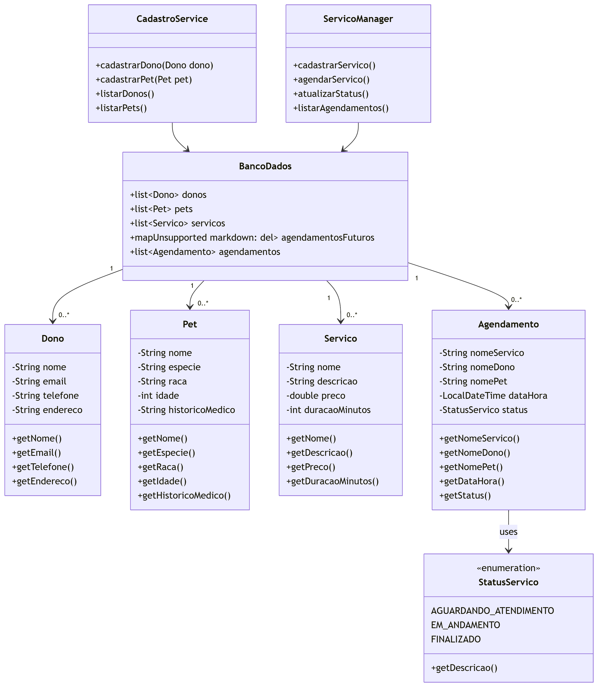

# 📌 PetVilla

## 🏆 Equipe

- **Antonio Tenorio**
- **Arthur Rodrigues**
- **Gabriel Victor**
- **Jácio Alves**
- **Lucas Carvalho**
- **Mateus Cavalcanti**

## 📖 Objetivo do Projeto

O projeto tem como finalidade facilitar o agendamento de serviços para pets em petshops, permitindo que donos de animais possam se cadastrar, visualizar agendamentos, acompanhar o status dos serviços e realizar cancelamentos. Além disso, fornece funcionalidades para administradores e funcionários do petshop gerenciarem serviços e agendamentos.

---

## 📐 Diagrama de Classes

_Diagrama mostra as relações entre Dono, Pet, Serviço, Agendamento e as classes de serviço._

---

## 📌 Histórias de Usuário

### 1️⃣ Cadastro de Dono e Pet

**Como dono de um pet, quero me cadastrar no sistema com meus dados pessoais e os do meu pet, para poder agendar serviços.**

**Critérios de Aceitação:**

- O sistema deve permitir o cadastro do dono do pet com nome, e-mail, telefone e endereço.
- O sistema deve permitir o cadastro do pet com nome, espécie, raça, idade e histórico médico (opcional).
- O sistema deve armazenar os dados cadastrados de forma segura.

---

### 2️⃣ Agendamento de Serviços

**Como cliente, quero agendar um serviço para meu pet, para garantir um horário disponível.**

**Critérios de Aceitação:**

- O sistema deve permitir que o cliente selecione um serviço disponível.
- O cliente deve escolher uma data e horário dentro dos disponíveis no sistema.
- O sistema deve validar a disponibilidade do serviço e do horário antes da confirmação.
- O cliente deve receber uma confirmação do agendamento via e-mail ou mensagem no sistema.

---

### 3️⃣ Visualização de Agendamentos

**Como administrador, quero visualizar todos os agendamentos cadastrados, para acompanhar os serviços dos pets.**

**Critérios de Aceitação:**

- O sistema deve exibir uma lista de todos os serviços.
- Cada agendamento deve exibir a data, horário, serviço agendado e status.
- O sistema deve exibir todos os agendamentos para os serviços cadastrados.

---

### 4️⃣ Acompanhamento do Status do Serviço

**Como cliente, quero acompanhar o status do serviço do meu pet em tempo real, para saber em que etapa ele está.**

**Critérios de Aceitação:**

- O sistema deve exibir o status do serviço (ex.: "Aguardando atendimento", "Em andamento", "Finalizado").
- O status deve ser atualizado em tempo real conforme a evolução do serviço.
- O sistema deve permitir a visualização do status pelo cliente em qualquer momento.

---

### 5️⃣ Cancelamento de Agendamento

**Como cliente, gostaria de cancelar um agendamento, para liberar o horário.**

**Critérios de Aceitação:**

- O sistema deve permitir que o cliente visualize seus agendamentos e selecione um para cancelar.
- O cancelamento só deve ser permitido dentro do prazo definido pelas regras do petshop.
- O sistema deve atualizar a disponibilidade do horário cancelado para outros clientes.

---

### 6️⃣ Gerenciamento de Serviços

**Como administrador do petshop, quero cadastrar e atualizar serviços oferecidos, para manter o sistema atualizado.**

**Critérios de Aceitação:**

- O sistema deve permitir o cadastro de novos serviços, incluindo nome, descrição, preço e duração.
- O sistema deve permitir a edição de serviços existentes, incluindo alteração de valores e disponibilidade.
- O sistema deve impedir a exclusão de serviços com agendamentos futuros.
- As alterações devem ser refletidas imediatamente para os clientes.

---

### 7️⃣ Consulta de Agendamentos por Funcionários

**Como funcionário do petshop, quero consultar os agendamentos do dia, para organização do trabalho.**

**Critérios de Aceitação:**

- O sistema deve exibir uma lista dos agendamentos do dia, ordenados por horário.
- Cada agendamento deve conter informações sobre o pet, o cliente e o serviço agendado.
- O funcionário deve poder filtrar os agendamentos por status (pendente, em andamento, finalizado).
- O sistema deve permitir a atualização do status do serviço.

---

## 🔍 Confirmação com BDD

### 1️⃣ Cadastro de Dono e Pet

#### 🟢 Cadastro bem-sucedido

**Dado** que um usuário deseja se cadastrar no sistema\
**Quando** ele informa seu nome, e-mail, telefone, endereço e os dados do pet\
**Então** o sistema deve armazenar os dados com segurança e exibir uma confirmação de cadastro.

#### 🔴 Tentativa de cadastro com dados incompletos

**Dado** que um usuário deseja se cadastrar no sistema\
**Quando** ele informa apenas parte dos dados obrigatórios\
**Então** o sistema deve impedir o cadastro e exibir uma mensagem de erro.

### 2️⃣ Agendamento de Serviços

#### 🟢 Agendamento bem-sucedido

**Dado** que um cliente deseja agendar um serviço para seu pet\
**Quando** ele seleciona um serviço, escolhe uma data e horário disponíveis\
**Então** o sistema valida a disponibilidade e confirma o agendamento.

#### 🔴 Agendamento em horário indisponível

**Dado** que um cliente tenta agendar um serviço\
**Quando** ele seleciona um horário já ocupado\
**Então** o sistema deve informar que o horário não está disponível e sugerir alternativas.

### 3️⃣ Visualização de Agendamentos

#### 🟢 Visualizar todos os agendamentos

**Dado** que um administrador deseja acompanhar os agendamentos dos serviços\
**Quando** ele acessa a seção de agendamentos\
**Então** o sistema exibe uma lista com data, horário, serviço e status.

### 4️⃣ Acompanhamento do Status

#### 🟢 Status atualizado em tempo real

**Dado** que um pet está passando por um serviço\
**Quando** o status do serviço é atualizado\
**Então** o cliente deve visualizar a atualização em tempo real.

### 5️⃣ Cancelamento de Agendamento

#### 🟢 Cancelamento permitido dentro do prazo

**Dado** que um cliente deseja cancelar um agendamento\
**Quando** ele seleciona um dentro do prazo permitido\
**Então** o sistema deve cancelar o serviço e disponibilizar o horário.

### 6️⃣ Gerenciamento de Serviços

#### 🟢 Cadastro de novo serviço

**Dado** que um administrador deseja adicionar um novo serviço\
**Quando** ele informa nome, descrição, preço e duração\
**Então** o sistema deve armazenar e disponibilizar o serviço.

---

## 🎥 Screencast

## Veja um vídeo de demonstração da prototipação do projeto: [Assista no YouTube](https://youtu.be/70ARcrTbTS4)

## Veja também o andamento do projeto no sistema:

[Assista no Youtube (Entrega 2)](https://youtu.be/wQYGl43RW9c)

[Assista no Youtube (Entrega 3)](https://youtu.be/zvVJmO5BLzQ)
(0 a 1:35: Screencast das novas histórias. 1:35 até o final: Screencast testes unitários)

📌 **Este documento será atualizado conforme o desenvolvimento do projeto.**
